# AWS Serverless Data Lake for Bid Requests

This experiment simulates data ingestion of bid requests to a serverless data lake and data analytics pipeline deployed on AWS. As a result you get a real time dashboard and a BI tool to analyse your stream of bid requests. Overview of the real time dashboard.

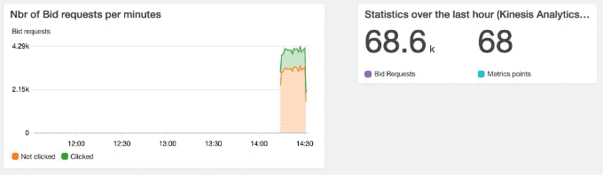

Services in use:

- [Amazon Kinesis Data Firehose](https://aws.amazon.com/kinesis/data-firehose/) for data ingestion,
- [Amazon Kinesis Data Analytics](https://aws.amazon.com/kinesis/data-analytics/) for data enhancement,
- [Amazon S3](https://aws.amazon.com/s3/) for data storage,
- [AWS Lambda](https://aws.amazon.com/lambda/) for publishing near real time measures,
- [Amazon QuickSight](https://aws.amazon.com/quicksight/) for data visualization,
- [Amazon CloudWatch](https://aws.amazon.com/cloudwatch/) for near real time data visualization,
- [AWS Fargate](https://aws.amazon.com/fargate/) for simulating bid requests.

[Data used](https://s3-eu-west-1.amazonaws.com/kaggle-display-advertising-challenge-dataset/dac.tar.gz) for this experiment are coming from the [Kaggle Display Advertising Challenge Dataset](https://labs.criteo.com/2014/02/download-kaggle-display-advertising-challenge-dataset/) published in 2014 by [Criteo](https://www.kaggle.com/c/criteo-display-ad-challenge/data). If you are curious or if you want to push the Criteo Dataset further, you can refer to their 2015 [announcement](https://labs.criteo.com/2015/03/criteo-releases-its-new-dataset/) and the related [download](https://labs.criteo.com/2013/12/download-terabyte-click-logs-2/).

Every time it is possible, this experiment leverages [AWS CDK](https://docs.aws.amazon.com/cdk/latest/guide/home.html) to deploy the required infrastructure.

## Table of content

- [Architecture overview](#architecture-overview)
- [Pre requisites](#pre-requisites)
- [Deployment of the experiment](#deployment-of-the-experiment)
  - [Downloading necessary Data](#downloading-necessary-data)
  - [Building the CDK application](#building-the-cdk-application)
  - [Deploying the stack and upload the data](#deploying-the-stack-and-upload-the-data)
  - [Deploying Amazon QuickSight](#deploying-amazon-quicksight)
    - [Preparing the Manifest file](#preparing-the-manifest-file)
    - [Signing\-up](#signing-up)
    - [Creating a dataset](#creating-a-dataset)
- [Exploring the demo](#exploring-the-demo)
  - [Launching the experiment](#launching-the-experiment)
    - [Launching the producer](#launching-the-producer)
    - [Launching the Kinesis Data Analytics Application](#launching-the-kinesis-data-analytics-application)
  - [Producer](#producer)
    - [Architecture overview of the producer layer](#architecture-overview-of-the-producer-layer)
    - [Lambda function](#lambda-function)
    - [AWS Fargate](#aws-fargate)
  - [Ingestion](#ingestion)
    - [Architecture overview of the ingestion layer](#architecture-overview-of-the-ingestion-layer)
    - [Kinesis Data Firehose](#kinesis-data-firehose)
    - [S3](#s3)
  - [Enhancement](#enhancement)
    - [Architecture overview of the enhancement layer](#architecture-overview-of-the-enhancement-layer)
    - [S3 for referential data](#s3-for-referential-data)
    - [Kinesis Data analytics SQL application](#kinesis-data-analytics-sql-application)
    - [AWS Lambda as a destination for a kinesis data analytics](#aws-lambda-as-a-destination-for-a-kinesis-data-analytics)
  - [Visualization](#visualization)
    - [Architecture overview of the visualization layer](#architecture-overview-of-the-visualization-layer)
    - [CloudWatch](#cloudwatch)
    - [QuickSight](#quicksight)
- [Cost](#cost)
- [Solutions alternatives](#solutions-alternatives)
- [Develop](#develop)
  - [Start watching for changes](#start-watching-for-changes)
  - [Useful commands](#useful-commands)
- [Clean up](#clean-up)
- [Inspiring source of information](#inspiring-source-of-information)

## Architecture overview

1. Producer: AWS Fargate simulates bid request pushes to Amazon Kinesis Data Firehose from the TSV "mock" file
2. Ingestion: Amazon Kinesis Data Firehose ingests the data into Amazon S3
3. Enhancement: Amazon Kinesis Data Analytics
    - enhances the data with catalog stored in Amazon s3
    - computes counters from the ingestion stream of records
    - triggers a AWS Lambda function to store real time counts in Amazon CloudWatch
4. Visualization:
    - Amazon CloudWatch allows visualization of custom near real-time metrics
    - Amazon Quick Sights allows reporting on raw data stored in Amazon S3


## Pre requisites

For this experiment you will need the following:

- The [AWS CLI](https://docs.aws.amazon.com/cli/latest/userguide/cli-chap-install.html)
- An AWS account. If you don’t have an AWS account, you can create a free account [here](https://portal.aws.amazon.com/billing/signup/iam).
- Node.js (>= 8.10). To install Node.js visit the [node.js](https://nodejs.org/en/) website. You can also a node version manager: [nvm](https://github.com/nvm-sh/nvm)
- The [AWS CDK](https://docs.aws.amazon.com/cdk/latest/guide/getting_started.html) toolkit: `$> npm install -g aws-cdk`

If this is the first time you deploy a CDK application in an AWS environment, you need to bootstrap it: `cdk bootstrap`. Please take a look at the bootstrap section of the [CDK workshop](https://cdkworkshop.com/20-typescript/20-create-project/500-deploy.html).

## Deployment of the experiment

In order to deploy this experiment in your account, you have four actions to take:

1. Download necessary data
2. Build the CDK application
3. Deploy the stack and upload the data
4. Deploy Amazon QuickSight

### Downloading necessary Data

Download the [data](https://s3-eu-west-1.amazonaws.com/kaggle-display-advertising-challenge-dataset/dac.tar.gz) and extract the `zip` file to the `data` directory.

**Important**: we don't want to upload the whole dataset, therefore we are taking a small amount of it with the following command in the `data` directory:

```bash
$> head -5000000 train.txt > bidrequests.txt
```

**Data fields** explanation:

- C0 (Integer) - Indicates if an ad was clicked (1) or not (0).
- C1-C13 - 13 columns of integer features mostly representing count features.
- C14-C39 - 26 columns of categorical features. The values of these features have been hashed onto 32 bits.

### Building the CDK application

At the root of the repository:

```bash
$> npm install
```

This will install all the AWS CDK project dependencies.

```bash
$> npm run build
```

This command will build the CDK application: compile Typescript code into Javascript.

### Deploying the stack and upload the data

To deploy the CDK application:

```bash
$> cdk deploy
```

This command will generate a cloud formation stack that will be pushed to your configured account. This will create around 60 resources (Roles, Streams, Lambda functions, Container Registry, etc.) and will also upload prepared data to the AWS Cloud.

Actual limitations:

- If you change parameters or code of the CloudWatch's dashboard, you must delete it in the console before deploying the update with `cdk`.
- The Cloudwatch's dashboard is configured for certain input and output ids of the Kinesis data analytics application. If the deployed dashboard doesn't work, please check the current `inputId` and `outpuId` of the Kinesis data analytics application (with: `aws kinesisanalytics describe-application --application-name EnhancementSQLApplication`), update the `./cdk/lib/visualization-construct.ts` accordingly and deploy the CDK application.

### Deploying Amazon QuickSight

In order to deploy the Amazon QuickSight dashboard, you must do the following:

1. Preparing a `manifest.json` file
2. Signing-up
3. Creating a dataset

A pre requisite to the deployment of Amazon QuickSight using a S3 bucket is that the data actually exist in the bucket. So, please follow this part once you have launch the data producer.

#### Preparing the Manifest file

On your local computer, edit the `manifest.json` file in the `visualization` folder. Use the output `DataExperimentStack.VisualizationLayerQuickSightManifestFile` of the deployed stack or replace `XXXXXXXXXXXXX` with the URi of you bucket in the provided `manifest.json` file.

For more information on the Manifest file, please have a look to [Supported Formats for Amazon S3 Manifest Files](https://docs.aws.amazon.com/quicksight/latest/user/supported-manifest-file-format.html).

#### Signing-up

If you have already [signed up](https://docs.aws.amazon.com/quicksight/latest/user/signing-up.html.) for Amazon QuickSight or you haven't selected this experiment raw data bucket during the sign-up, please allow QuickSight to [read the bucket](https://docs.aws.amazon.com/quicksight/latest/user/managing-permissions.html) of this experiment. You can find the bucket name in the output of the `cdk deploy` command line or from the `Cloud Formation` console.

#### Creating a dataset

In this section you are going to create a [new QuickSight dataset using Amazon S3 files](https://docs.aws.amazon.com/quicksight/latest/user/create-a-data-set-s3.html).

From the [QuickSight home page](https://us-east-1.quicksight.aws.amazon.com/sn/start):

1. Click on "Manage Data"
2. Click on "New Data Set"
3. Select "S3"
4. Enter a "Data Source Name" and select your local `manifest.json` file.


5. Click "Connect"

You should see the following screen:


Your good to go with the QuickSight deployment. For an exploration of Quicksight for this experiment, see [Exploring the demo](#exploring-the-demo).

Once the import is finished, you will get the following screen:


Note: Amazon QuickSight has certain [Data Source Limits](https://docs.aws.amazon.com/quicksight/latest/user/data-source-limits.html). In particular, the total size of the files specified in the manifest file can't exceed 25 GB, or you can't exceed 1,000 files. Therefore, as we are pointing to row data, we should only indicate a particular day in the `manifest.json` file. For instance:

```json
{
  "fileLocations": [
    {
      "URIPrefixes": [
        "https://s3.us-east-1.amazonaws.com/dataexperimentstack-bidrequestexperimentstoragecc-XXXXXXXXXXXXX/raw-data/2019/09/01/"
      ]
    }
  ],
  "globalUploadSettings": {
    "format": "TSV",
    "delimiter": "\t",
    "containsHeader": "false"
  }
}
```

## Exploring the demo

Before starting the exploration of the demo, let's launch the producer and application. This will populate the demonstration with data and we will have something to look at.

### Launching the experiment

#### Launching the producer

As part of the demo, we have deployed a lambda function to simplify the launch of the producer running on AWS Fargate.

To launch the producer execute the command line that you get as an output of the deployed demo in the output named `DataExperimentStack.ProducerLayerlaunchProducerOnMacOS` or `DataExperimentStack.ProducerLayerlaunchProducerOnLinux`. On MacOS, it will look like this.

```bash
$> aws lambda invoke --function-name arn:aws:lambda:us-east-1:XXXXXXXXXXXX:function:DataExperimentStack-ProducerLayerProducerLauncherD-XXXXXXXXXXXXX --payload '{}' /tmp/out --log-type Tail --query 'LogResult' --output text | base64 -D
```

As an output you get the [ARN](https://docs.aws.amazon.com/general/latest/gr/aws-arns-and-namespaces.html) of the running task.

Note: If you encounter the following error `"Unable to assume the service linked role. Please verify that the ECS service linked role exists."` while launching the producer, please follow instructions [here](https://docs.aws.amazon.com/AmazonECS/latest/developerguide/using-service-linked-roles.html#create-service-linked-role) and create the linked service role:

```bash
$> aws iam create-service-linked-role --aws-service-name ecs.amazonaws.com
```

#### Launching the Kinesis Data Analytics Application

In order to get enhanced results and real time metrics, you need to also launch the Kinesis Data Analytics Application. To do so, execute the following command:

```bash
$> aws kinesisanalytics start-application --application-name EnhancementSQLApplication --input-configurations Id=1.1,InputStartingPositionConfiguration={InputStartingPosition=LAST_STOPPED_POINT}
```

Depending on the number of deployments and changes you made to the following CDK application, the input Id of the Kinesis Data Analytics application may change. You can get the right `InputId` with the following command: `aws kinesisanalytics describe-application --application-name EnhancementSQLApplication`.

Note: you can also stop the application with the AWS CLI with the following command line:

```bash
$> aws kinesisanalytics stop-application --application-name EnhancementSQLApplication
```

### Producer

#### Architecture overview of the producer layer

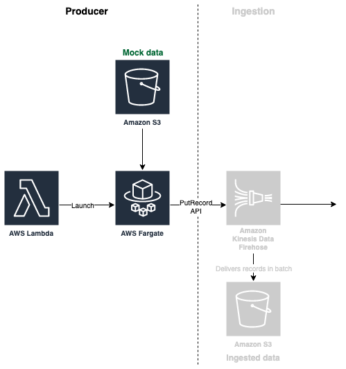

The data are pushed to Amazon Kinesis from a producer layer based on a python program running into a container on AWS Fargate.

The key components of the producer are:

- A virtual private cloud to host your producer (not detailed here),
- A lambda function that ease the launch of the producer,
- A container registry to host the Docker image of the producer (not detailed here)
- A task definition which defines how to run the producer,

You can get a list of all resources deployed related to the producer in the Cloud Formation console for the stack `DataExperimentStack` and searching for "Producer" in the resources search field.

#### Lambda function

AWS Lambda is a compute service that lets you run code without provisioning or managing servers.

In the present case, we use AWS Lambda to launch the Fargate Task from all the necessary information provided at deployed time by the CDK application:

- The [ECS cluster](https://docs.aws.amazon.com/AmazonECS/latest/developerguide/ECS_clusters.html)
- The private subnets of the newly launched [VPC](https://docs.amazonaws.cn/en_us/vpc/latest/userguide/what-is-amazon-vpc.html)
- The [task definition](https://docs.aws.amazon.com/AmazonECS/latest/developerguide/task_definitions.html)

To access the deployed lambda function:

1. Go to your AWS Account,
1. Search for Lambda,
1. Look for a function name starting with `"DataExperimentStack-ProducerLayerProducerLauncher"`
1. Click on the function name

You will see the following screen:


If you scroll down the page, you will notably see the "Environment variables" that are provided to the lambda function at deployment time and necessary to launch the Fargate Task.

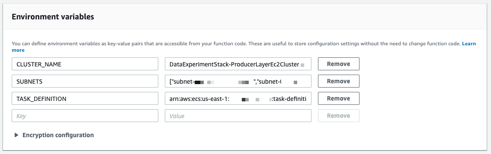

#### AWS Fargate

AWS Fargate is a compute engine for [Amazon ECS](https://docs.aws.amazon.com/AmazonECS/latest/developerguide/Welcome.html) that allows you to run containers without having to manage servers or clusters.

In the present case, we leverage AWS Fargate to host the program that will continuously - until we stop it or it has pushed all records - push records to the Kinesis Firehose ingestion stream.

1. Search for the ECS service,
2. Click on "Clusters" on the left panel
3. Search for "Producer"

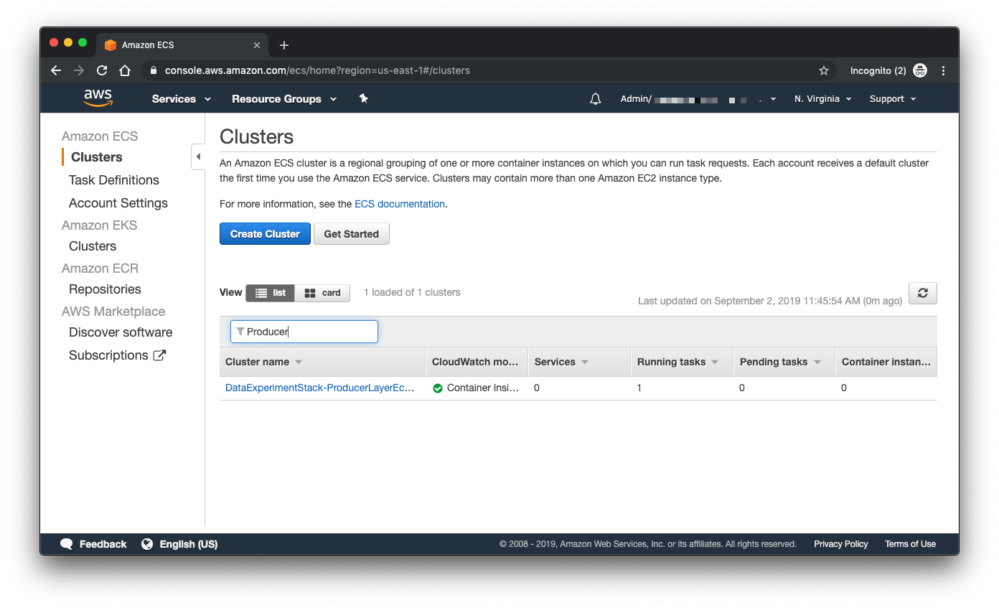

4. Click on the cluster name, then on the "Task" tabulation. You get the following screen.

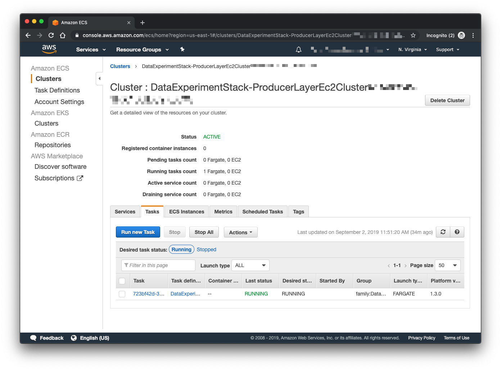

5. Click on the "Running" task

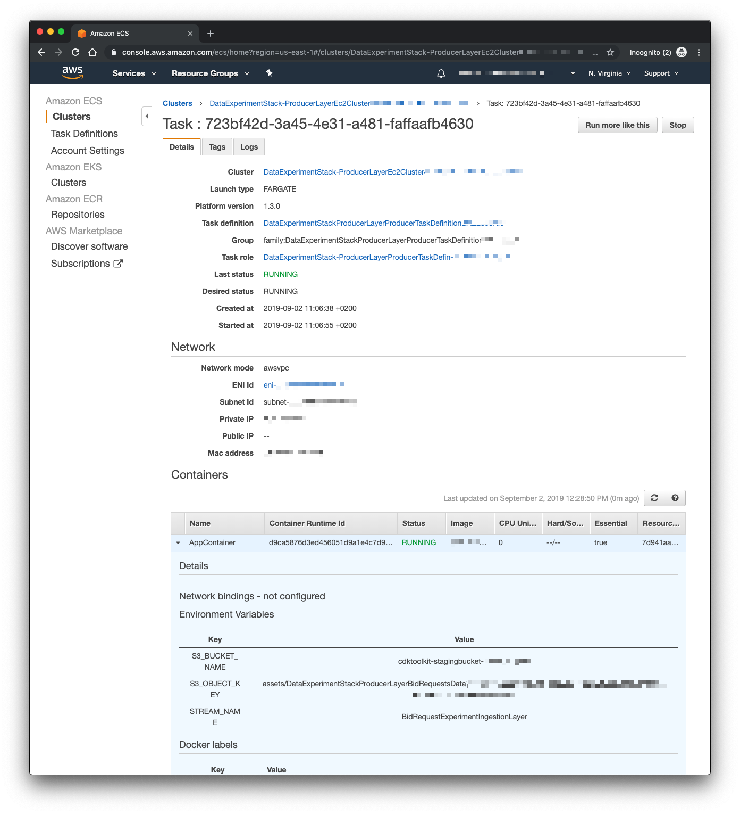

From here, you can check the status of the task and access logs.

**Troubleshooting**: if you want to check that your producer is effectively and successfully sending events to your ingestion layer, you can look at the logs of your Fargate task. If everything is going well, you will read messages like `"SUCCESS: your request ID is : ebc2c2b9-c94a-b850-be24-30ee9c33a5e7"`.

### Ingestion

#### Architecture overview of the ingestion layer

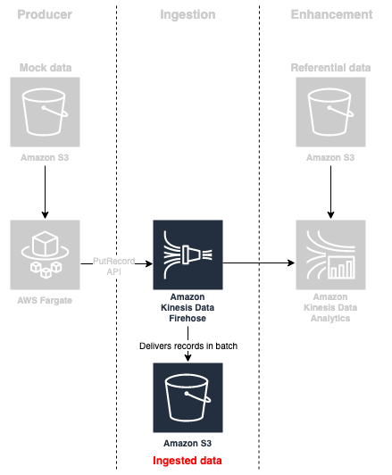

The data generated by the producer are pushed to an ingestion layer made of:

- A Kinesis Data Firehose [delivery stream](https://docs.aws.amazon.com/firehose/latest/dev/basic-create.html)
- A destination [S3 bucket](https://docs.aws.amazon.com/AmazonS3/latest/dev/UsingBucket.html) for raw data

#### Kinesis Data Firehose

Amazon Kinesis Data Firehose is a fully managed service to load streaming data into data stores and analytics tools. It can capture, transform, compress and load streaming data into various destination such as Amazon S3 or Amazon Elasticsearch Service. It automatically scales to the load. Further details [here](https://aws.amazon.com/kinesis/data-firehose/faqs/).

1. Open the [Kinesis Dashboard](https://console.aws.amazon.com/kinesis/home?region=us-east-1#/dashboard).

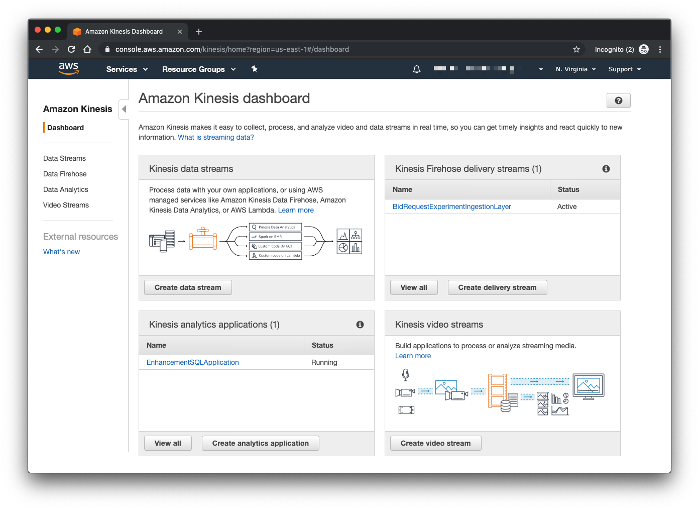

2. From here, open the `"BidRequestExperimentIngestionLayer"` kinesis delivery stream
3. Inspect the details of the stream, in particular take a look at the Amazon S3 destination configuration

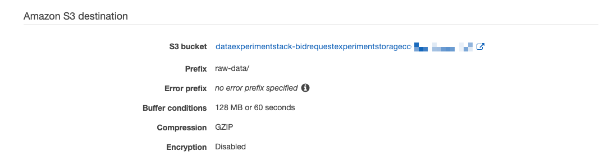

The buffer conditions of `"128 MB or 60 seconds"` mean that the data will be written to AWS S3 every 60 seconds or when the buffer reach 128 MB. In our case, data are written to S3 every 60 seconds. See in the next paragraph.

4. Click on the `"Monitoring"` tabulation

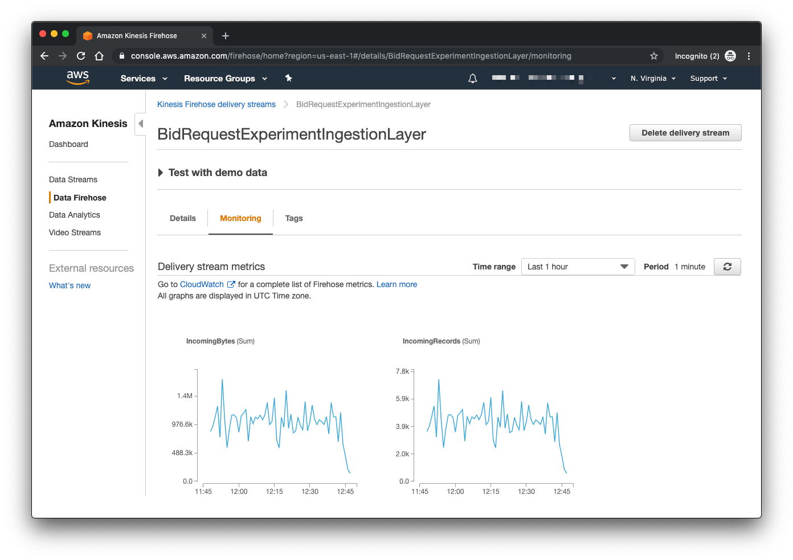

This tabulation provides a monitoring view of the stream like the number of "Incoming records" per minutes or the "Incoming Bytes". You can access all Firehose and delivery stream metrics in [AWS Cloudwatch](https://console.aws.amazon.com/cloudwatch/home?region=us-east-1#metricsV2:namespace=AWS/Firehose).

#### S3

Amazon Simple Storage Service (S3) is a storage designed for the Internet scale. In this experiment, S3 is a fully managed serverless data lake. It automatically scales, and you don't need to provision any storage space.

1. From the Kinesis Firehose delivery stream details page, click on the S3 bucket link from the "Amazon S3 destination" section.
2. Open the `"raw-data"` folder then navigate the structure up to a list of files.

Firehose has been configured to push all data in the `"raw-data"` folder in S3. After that all data are pushed according the its buffer configuration to the actual `"YYYY/MM/DD/HH"` [UTC](https://docs.aws.amazon.com/firehose/latest/dev/create-destination.html)

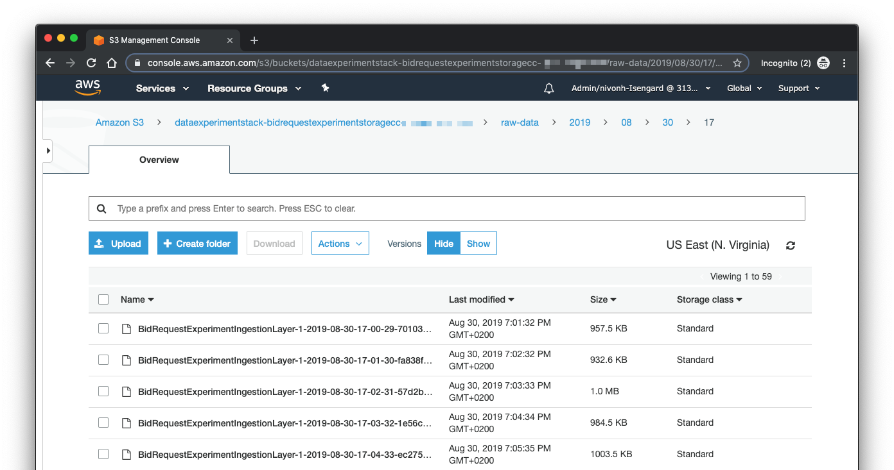

### Enhancement

#### Architecture overview of the enhancement layer

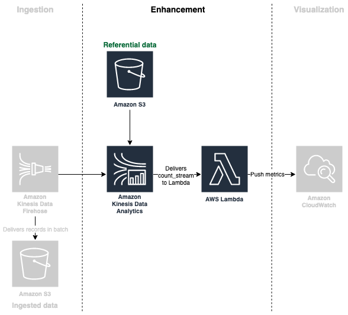

The data ingested are processed through an SQL application that enhances the data from a referential stored on S3 and compute analytics on top of the initial ingestion stream. The results of this application are pushed as custom metrics in AWS CloudWatch. This enhancement layer is made of :

- A Kinesis Data Analytics [SQL application](https://docs.aws.amazon.com/kinesisanalytics/latest/dev/how-it-works.html),
- A [Lambda function](https://docs.aws.amazon.com/kinesisanalytics/latest/dev/how-it-works-output-lambda.html) that push the results of the Data Analytics application to CloudWatch [custom metrics](https://docs.aws.amazon.com/AmazonCloudWatch/latest/monitoring/publishingMetrics.html),
- A S3 object that represents a table to [add reference data](https://docs.aws.amazon.com/kinesisanalytics/latest/dev/app-add-reference-data.html) to the ingestion stream.

#### S3 for referential data

S3 is used to store the referential file that is then connected to the Kinesis application.

1. Open the [Kinesis Dashboard](https://console.aws.amazon.com/kinesis/home?region=us-east-1#/dashboard).
2. Open the `"EnhancementSQLApplication"` in the Kinesis Analytics Application card.

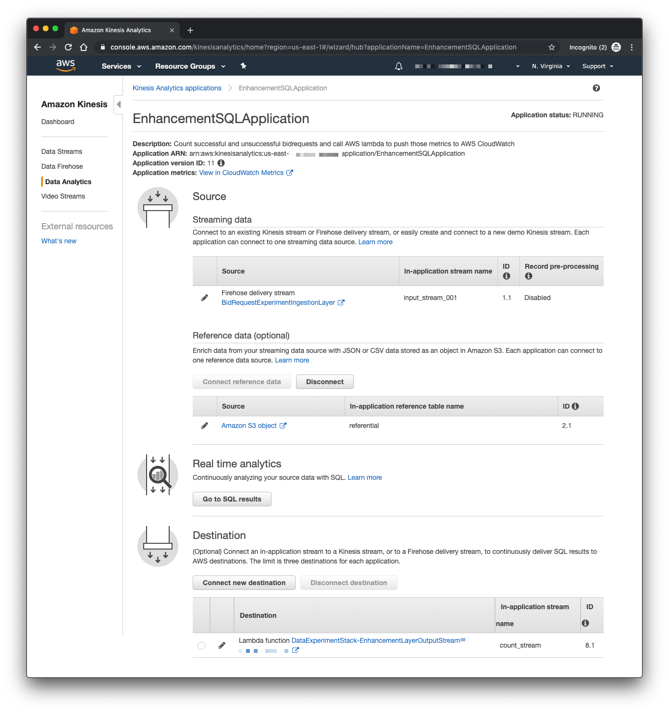

3. You can see the Amazon S3 Object as a reference data and its associated "In-application reference table name" that can be used in the SQL application (see [below](#kinesis-data-analytics-sql-application))

See [Example: Adding Reference Data to a Kinesis Data Analytics Application](https://docs.aws.amazon.com/kinesisanalytics/latest/dev/app-add-reference-data.html) for further details on the topic.

#### Kinesis Data analytics SQL application

A Kinesis Data Analytics application continuously reads and processes streaming data in real time. You write application code using SQL or Java to process the incoming streaming data and produce output(s). In our case, we use an SQL application.

Kinesis Data Analytics then writes the output to a configured destination. The following diagram illustrates a typical application architecture.


This experiment leverages as a:

- Source:
  - The in-application input stream from the ingestion layer
  - A reference table (see [above](#s3-for-referential-data))
- Real-time analytics:
  - SQL code
  - 2 in-application output streams
- Destination:
  - A [lambda function](https://docs.aws.amazon.com/kinesisanalytics/latest/dev/how-it-works-output-lambda.html)

1. Open the [Kinesis Dashboard](https://console.aws.amazon.com/kinesis/home?region=us-east-1#/dashboard).
2. Open the `"EnhancementSQLApplication"` in the Kinesis Analytics Application card.
3. You can see the Firehose delivery stream a streaming data and its associated "In-application reference table name" that can be used in the SQL application
4. Click "Go to SQL results"

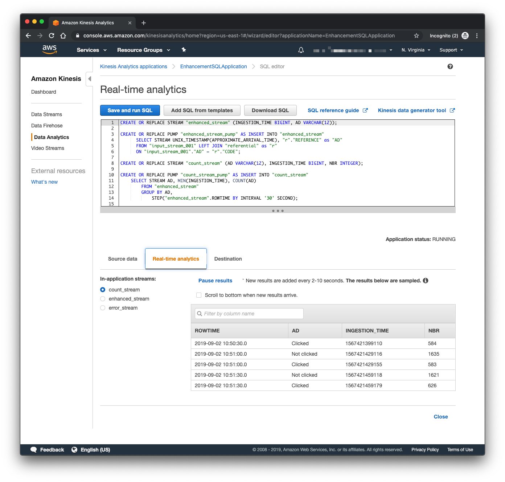

From here you can navigate the application, edit the SQL, see incoming data, and real-time computed analytics.

SQL code:

```sql
CREATE OR REPLACE STREAM "enhanced_stream" (INGESTION_TIME BIGINT, AD VARCHAR(12));

CREATE OR REPLACE PUMP "enhanced_stream_pump" AS INSERT INTO "enhanced_stream"
      SELECT STREAM UNIX_TIMESTAMP(APPROXIMATE_ARRIVAL_TIME), "r"."REFERENCE" as "AD"
      FROM "input_stream_001" LEFT JOIN "referential" as "r"
      ON "input_stream_001"."AD" = "r"."CODE";

CREATE OR REPLACE STREAM "count_stream" (AD VARCHAR(12), INGESTION_TIME BIGINT, NBR INTEGER);

CREATE OR REPLACE PUMP "count_stream_pump" AS INSERT INTO "count_stream"
    SELECT STREAM AD, MIN(INGESTION_TIME), COUNT(AD)
        FROM "enhanced_stream"
        GROUP BY AD,
            STEP("enhanced_stream".ROWTIME BY INTERVAL '30' SECOND);
```

The [SQL language supported by Kinesis data analytics applications](https://docs.aws.amazon.com/fr_fr/kinesisanalytics/latest/sqlref/analytics-sql-reference.html) is based on the SQL:2008 standard with some extensions to enable operations on streaming data such as the `CREATE OR REPLACE STREAM` statement that creates a stream accessible to other statements in the [SQL](https://docs.aws.amazon.com/kinesisanalytics/latest/sqlref/analytics-sql-reference.html) application and adds a continuous delivery stream output to the application.

This stream can then be connected to a destination: a Kinesis stream, a Kinesis Firehose delivery stream or an AWS Lambda function.

A [pump](https://docs.aws.amazon.com/kinesisanalytics/latest/dev/streams-pumps.html) is a continuous insert query running that inserts data from one in-application stream to another in-application stream.

This SQL application is commonly named a multi-step application:

1. we create a stream and [extend the data with a referential](https://docs.aws.amazon.com/kinesisanalytics/latest/dev/app-add-reference-data.html)
2. we use that stream to perform an aggregation with a [tumbling window](https://docs.aws.amazon.com/kinesisanalytics/latest/dev/tumbling-window-concepts.html) - non-overlapping manner, here every 30 seconds.

#### AWS Lambda as a destination for a kinesis data analytics

1. Open the [Kinesis Dashboard](https://console.aws.amazon.com/kinesis/home?region=us-east-1#/dashboard).
2. Open the `"EnhancementSQLApplication"` in the Kinesis Analytics Application card.
3. You can see the Lambda function as a destination of the Kinesis Analytics application.
4. Click the lambda function name

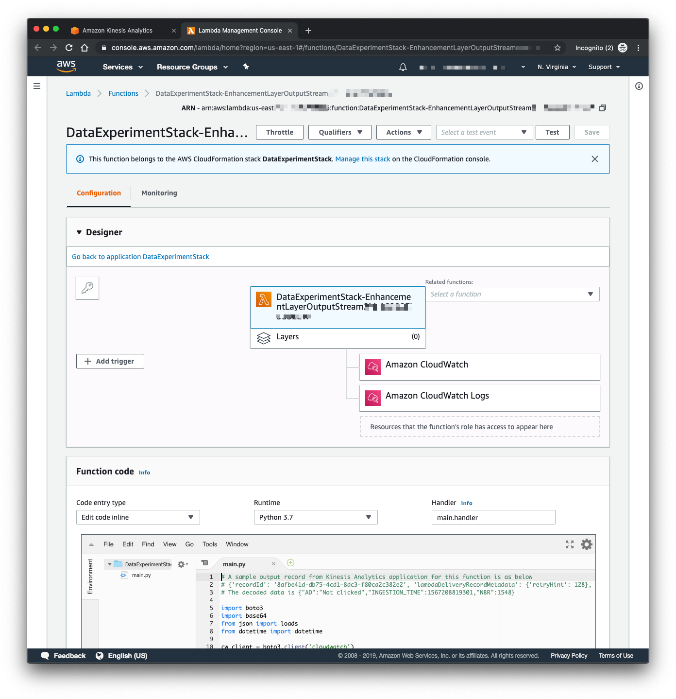

5. Inspect the code that pushes [custom metrics to Cloud Watch](https://docs.aws.amazon.com/AmazonCloudWatch/latest/monitoring/publishingMetrics.html)
6. Open the monitoring tabulation

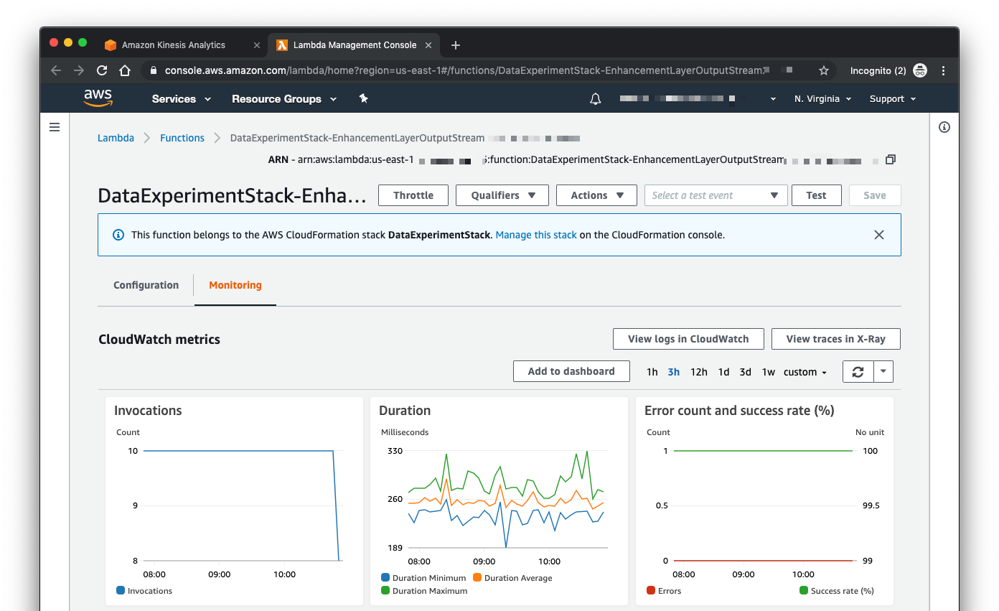

You notice that the lambda function is called 10 times every 5 minutes. From [Using a Lambda Function as Output](https://docs.aws.amazon.com/kinesisanalytics/latest/dev/how-it-works-output-lambda.html):

> If records are emitted to the destination in-application stream within the data analytics application as a tumbling window, the AWS Lambda destination function is invoked per tumbling window trigger. For example, if a tumbling window of 60 seconds is used to emit the records to the destination in-application stream, the Lambda function is invoked once every 60 seconds.

As our tumbling window is 30 seconds, we are called two times per minutes, 10 times every 5 minutes.

### Visualization

#### Architecture overview of the visualization layer

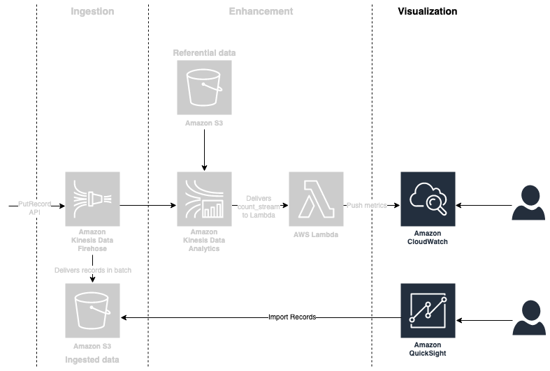

The data ingested by the [ingestion layer](#ingestion) and the custom metrics generated by the [enhancement layer](#enhancement)are displayed through two distinct visualization system with different purposes:

- A [Cloud Watch dashboard](https://docs.aws.amazon.com/AmazonCloudWatch/latest/monitoring/CloudWatch_Dashboards.html),
- Amazon QuickSight [visualizations](https://docs.aws.amazon.com/quicksight/latest/user/working-with-visual-types.html)

#### CloudWatch

Amazon CloudWatch dashboards are customizable home pages in the CloudWatch [console](https://console.aws.amazon.com/cloudwatch/home) that you can use to monitor your resources in a single view. You can include custom metrics in these dashboards.

1. Open the CloudWatch [console](https://console.aws.amazon.com/cloudwatch/home)
2. On the left panel click on "Dashboards"
3. Click on the [BidRequestRealTimeDashboard](https://console.aws.amazon.com/cloudwatch/home?dashboards:name=BidRequestRealTimeDashboard)

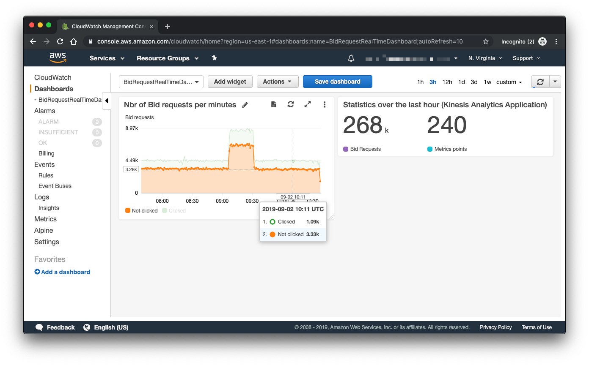

In the above example, between 9AM and 9:30AM you can see a spike. It is because a second producer has been temporary launched. Kinesis Data Firehose adjust automatically to ingest the additional bid requests.

The dashboard provides two views:

- "Nbr of Bid requests per minutes": it is based on the custom metrics from the enhancement layer. It sums the values every minutes.
- "Statistics over the last hour": it is based on the standard metrics provided by Kinesis Data Analytics. It sums the values over the last hour.

You can further explore the source code of the widgets and the dashboard. You can easily extend the dashboard to your will.

#### QuickSight

Amazon QuickSight is a fast cloud native business intelligence service that makes it easy to deliver insights to everyone in your organization. It is a fully managed service, it scales automatically and you have nothing to provisioned.

1. Go to your AWS Account,
1. Search for Quicksight and open [it](https://us-east-1.quicksight.aws.amazon.com/sn/start).
1. You can create and add:
    - [Sheets](https://docs.aws.amazon.com/quicksight/latest/user/working-with-multiple-sheets.html)
    - [Filters](https://docs.aws.amazon.com/quicksight/latest/user/adding-a-filter.html)
    - [Calculated field](https://docs.aws.amazon.com/quicksight/latest/user/working-with-calculated-fields.html)
    - [Visual](https://docs.aws.amazon.com/quicksight/latest/user/working-with-visuals.html)
    - [Insights](https://docs.aws.amazon.com/quicksight/latest/user/making-data-driven-decisions-with-ml-in-quicksight.html)
1. And [publish](https://docs.aws.amazon.com/quicksight/latest/user/example-create-a-dashboard.html) and [share](https://docs.aws.amazon.com/quicksight/latest/user/sharing-a-dashboard.html) your work as dashboards

Here is a sampled Analysis I made based on the ingested data.

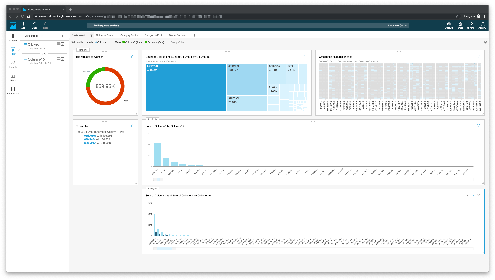.

## Cost

This paragraph describes the cost of this experiment for one hour of produced data by one producer detailed by layer and services. It roughly represents 270k records and 240 custom metrics (60 * 2 * 2).

All prices are for the `us-east-1` AWS region.

**Usage details**:

- Producer:
  - [Lambda](https://aws.amazon.com/lambda/pricing/):
    - Memory: 128MB
    - Duration: 2000 ms
  - [Fargate](https://aws.amazon.com/fargate/pricing/):
    - Task: 1
    - vCPU: 0.5 (512 CPU unit requested, see [here](https://docs.aws.amazon.com/AmazonECS/latest/developerguide/task_definition_parameters.html) for details)
    - Memory: 512 MB
  - Amazon S3:
    - Mock file storage: 1.1 GB
- Ingestion
  - [Kinesis Data Firehose](https://aws.amazon.com/kinesis/data-firehose/pricing/):
    - Records: 270000
    - Record size: 0.5KB
  - Amazon S3:
    - Ingested Raw Data: 0.27 GB
- Enhancement
  - [Kinesis Data Analytics](https://aws.amazon.com/kinesis/data-analytics/pricing/) SQL Application:
    - [KPUs](https://console.aws.amazon.com/cloudwatch/home?region=us-east-1#metricsV2:graph=~(metrics~(~(~'AWS*2fKinesisAnalytics~'KPUs~'Application~'EnhancementSQLApplication))~view~'timeSeries~stacked~false~region~'us-east-1~start~'-P3D~end~'P0D~stat~'Sum~period~3600);query=~'*7bAWS*2fKinesisAnalytics*2cApplication*7d*20kinesis): 1
  - [Lambda](https://aws.amazon.com/lambda/pricing/):
    - Memory: 128 MB
    - Duration: 32000 ms (120 * ~ 270 ms)
  - Amazon S3:
    - Referential file: 39 B
- Visualization
  - [CloudWatch](https://aws.amazon.com/cloudwatch/pricing/):
    - Dashboard: 1
    - Custom metrics: 2
    - Custom metrics put: 240
  - [Amazon Quicksight](https://aws.amazon.com/quicksight/pricing/):
    - Admin: 1

**Total costs**:

- Lambda (assuming the whole [lambda free tier](https://aws.amazon.com/free/?all-free-tier.sort-by=item.additionalFields.SortRank&all-free-tier.sort-order=asc&awsf.Free%20Tier%20Categories=categories%23compute) has been consumed):
  - Cost: 121 executions * $0.0000002 + 34000 / 100 * $0.000000208 = **$0**
- Fargate:
  - CPU charges: 1 task * O.5 vCPU * $0.04048 * 1 hour = **$0.02024**
  - Memory charges: 1 task * 0.5 GB * $0.004445 * 1 hour = **$0.0022225**
- Kinesis Data Firehose:
  - Total record size (each record rounded to nearest 5KB): 1.35GB
  - Cost: 1.35 * $0.029 = **$0.03915**
- Kinesis Data Analytics:
  - Cost: 1 KPU * $0.11 = **$0.11**
- CloudWatch (assuming the whole [CloudWatch free tier](https://aws.amazon.com/free/?all-free-tier.sort-by=item.additionalFields.SortRank&all-free-tier.sort-order=asc&awsf.Free%20Tier%20Categories=*all&all-free-tier.q=cloudwatch&all-free-tier.q_operator=AND) has been consumed):
  - Cost Dashboard: **$3**
  - Cost custom metrics: 1 metric * $0.3 = **$0.3**
  - Cost API Calls (push custom metrics + dashboard display) ~ to 1000 calls: 1 * $0.01 = **$0.01**
- Amazon S3 (Assuming data will stay on S3 for one month):
  - Cost storage: ~ 1.4 GB * $0.023 = **$0.0323**
  - Cost API ~ to 1000 calls PUT and 1000 calls GET: 1 * $0.005 + 1 * $0.0004= **$0.00504**
- QuickSight (Assuming paying for one month):
  - Cost author: **$24**

**Total**: < $30

## Solutions alternatives

Although the cost can't be simply multiply when you scale your application - decreasing price mechanism notably apply to several services and the QuickSight fees would be mostly the same until you require more capacities - it is interesting to look at specific parts of this architecture and estimate what would be the cost with the presented technology and some alternatives.

Example: What would be the cost of the ingestion layer for 800.000 bid requests / seconds for 1 hour?

Architecture alternatives to Kinesis Data Firehose for data ingestion:

- [Amazon Kinesis Data Stream](https://aws.amazon.com/kinesis/data-streams/): It is a massively scalable and durable real-time data streaming service. In the same fashion than Amazon Kinesis Data Firehose except that you must manage shards.
- [Amazon DynamoDB](https://aws.amazon.com/dynamodb/): It is a fully managed and serverless key-value and document database that delivers single-digit millisecond performance at any scale. We could use its API to push records directly into the database and later on using it.
- [Amazon MSK](https://aws.amazon.com/msk): it is a fully managed Apache Kafka service that makes it easy for you to build and run applications to process streaming data.

[Kinesis Data Firehose](https://aws.amazon.com/kinesis/data-firehose/pricing/):

- Total record size (each record rounded to nearest 5KB): 800000 * 60 * 60 * 5KB = 14.4 TB (14400 GB)
- Cost: $0.029 * 14400 = **$417.6**

[Kinesis Data Stream](https://aws.amazon.com/kinesis/data-streams/pricing/):

- "One shard provides ingest capacity of 1MB/sec or 1000 records/sec"
- "A PUT Payload Unit is counted in 25KB payload “chunks” that comprise a record"
- Each record is 0.5 KB, so 1000 records represents 0.5 MB. One shard will handle 1000 records/sec
- Each record represents 1 PUT Payload Unit
- At 800000 records/ses:
  - 800 shards are necessary
  - it represents 2,880,000,000 PUT Payload Unit
- Cost: 800 shards * $0.015 + 2,880 PUT payload units * $0.014 = **$52,32**

[Amazon DynamoDB](https://aws.amazon.com/dynamodb/pricing/):

- "For items up to 1 KB in size, one WCU can perform one standard write request per second."
- 800000 WCU are necessary to write records in the table
- Cost write: 800000/s over one hour * $0.00065/hour = **$520** (Doesn't include reading cost)
- Cost storage: 800000 * 60 * 60 * 0.5 KB = 1440 GB * $0.25 = **$360**

[Amazon MSK](https://aws.amazon.com/msk/pricing):

- Assuming a broker instance `kafka.m5.24xlarge` can handle 200000 requests / sec
- Broker cost: 4 * $10.08 = **$40.32**
- Broker Storage Cost: 800000 * 60 * 60 * 0.5 KB = 1440 GB * $0.1 = **$140**

In that example, Amazon Kinesis Data Stream is the winner. In that case it would be necessary to manage scaling of the kinesis stream. 800 shards won't always be necessary.

At a larger scale, some optimization and best practices will be necessary. Other alternatives might be tested (such as EC2 fleet behind a load balancer):

- Records grouping to reduce the amount of records to ingest
- Geo distribution of ingestion layer to reduce latency
- Enhancement of Elasticity

To learn more about real time bidding on AWS, read the [whitepaper](https://d1.awsstatic.com/whitepapers/Building_a_Real_Time_Bidding_Platform_on_AWS_v1_Final.pdf).

## Develop

Since this CDK project is typescript based, sources need to be compiled to JavaScript every time you make a modification to source files. This project is configured with a nice little npm script called `watch` that automatically compile `.js` file every time you make a change

### Start watching for changes

In the home directory, open a new terminal and enter:

```bash
$> npm run watch
```

### Useful commands

- `npm run build`   compile typescript to js
- `npm run watch`   watch for changes as you edit the application and compile
- `cdk deploy`      deploy this stack to your default AWS account/region
- `cdk diff`        compare deployed stack with current state
- `cdk synth`       emits the synthesized CloudFormation template
- `cdk destroy`     destroy the CDK application in your default AWS account/region

Note: a `cdk diff` command might take up to the minute. The main reason here is that the CDK command perform a hash of a very big file (`train.txt`) that we are uploading as an asset of the application.

## Clean up

Delete data of the Raw Data Bucket (output `rawBucket` of the stack) and destroy the CDK application:

```bash
$> aws s3 rm s3://dataexperimentstack-bidrequestexperimentstoragecc-XXXXXXXXXXXXX --recursive
$> cdk destroy
```

## Inspiring source of information

1. Producer:
    - [Data](https://s3-eu-west-1.amazonaws.com/kaggle-display-advertising-challenge-dataset/dac.tar.gz)
    - [Pushing csv to Kinesis firehose](https://github.com/cetic/push2firehose)
    - [Uploading data to s3](https://docs.aws.amazon.com/cdk/latest/guide/assets.html) leveraging the Amazon S3 assets type
    - [Creating an AWS Fargate Service Using the AWS CDK](https://docs.aws.amazon.com/cdk/latest/guide/ecs_example.html)
    - [aws-ecs-patterns](https://docs.aws.amazon.com/cdk/api/latest/docs/aws-ecs-patterns-readme.html) CDK module
    - [fargate-service-with-logging](https://github.com/aws-samples/aws-cdk-examples/blob/master/typescript/ecs/fargate-service-with-logging/index.ts)
    - [Building docker image with CDK](https://docs.aws.amazon.com/cdk/api/latest/docs/aws-ecr-assets-readme.html)
    - [ecs-demo Dockerfile](https://github.com/aws-samples/ecs-demo-php-simple-app/blob/master/Dockerfile)
    - [Deploy Go Applications to ECS using AWS CDK](https://medium.com/tysonworks/deploy-go-applications-to-ecs-using-aws-cdk-1a97d85bb4cb) and its [repository](https://github.com/TysonWorks/cdk-examples/tree/master/typescript/ecs-go-api)
2. Ingestion:
    - [Creating a kinesis firehose with CDK](https://docs.aws.amazon.com/cdk/api/latest/docs/@aws-cdk_aws-kinesisfirehose.CfnDeliveryStream.html) + supportive [CloudFormation documentation](https://github.com/awsdocs/aws-cloudformation-user-guide/blob/master/doc_source/aws-resource-kinesisfirehose-deliverystream.md)
3. Enhancement:
    - [Creating a kinesis data analytics application with CDK](https://docs.aws.amazon.com/cdk/api/latest/docs/aws-kinesisanalytics-readme.html) + supportive [CloudFormation documentation](https://docs.aws.amazon.com/AWSCloudFormation/latest/UserGuide/aws-resource-kinesisanalyticsv2-application.html)
    - Uploading reference file to S3
    - Send results to S3
    - Enhance data
    - Connect a lambda function to publish metrics to lambda start [here](https://github.com/aws-samples/realtime-web-analytics-workshop/blob/master/module-2/README.md) and [here](https://github.com/aws-samples/realtime-web-analytics-workshop/blob/master/module-3/README.md)
4. Visualization:
    - [Create an Analysis using Your own Amazon S3 Data](https://docs.aws.amazon.com/quicksight/latest/user/getting-started-create-analysis-s3.html)
    - [Create a graph in Amazon CloudWatch](https://github.com/aws-samples/realtime-web-analytics-workshop/blob/master/module-3/README.md) the idea is to provide number of clicked and not clicked ads per minute
