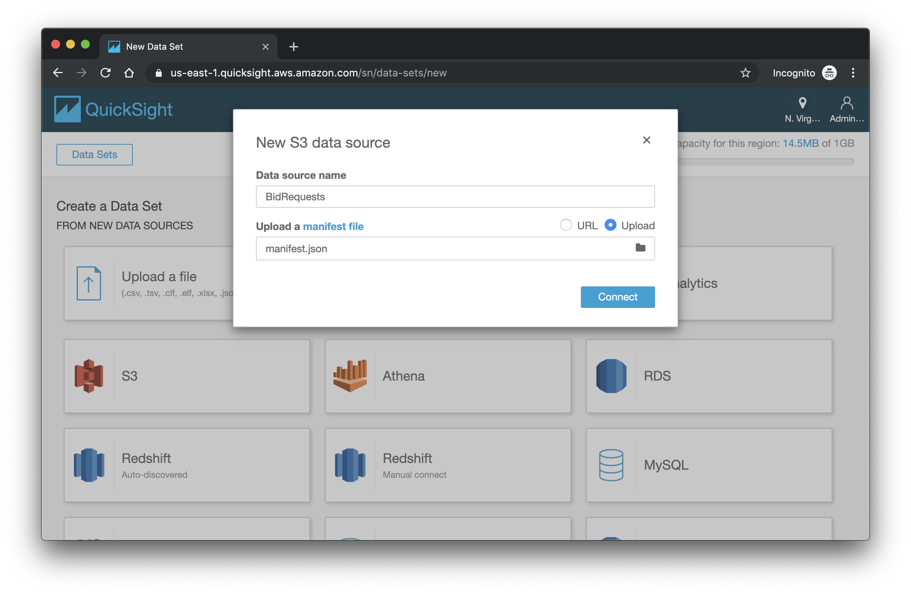
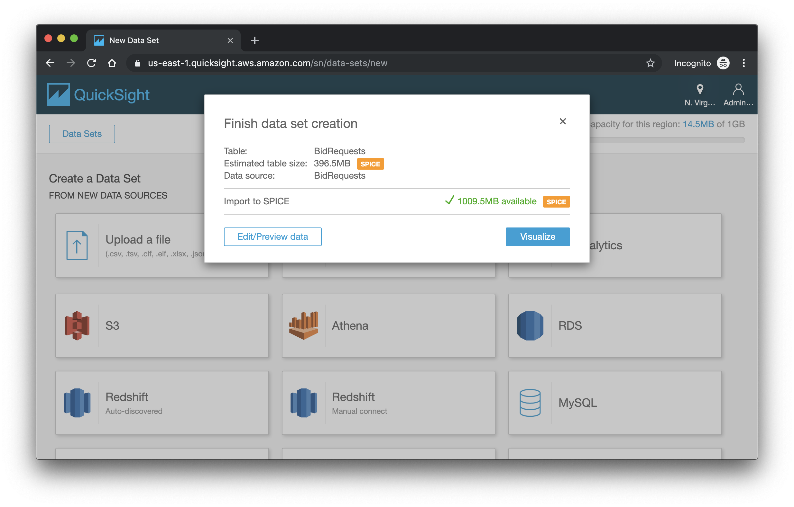
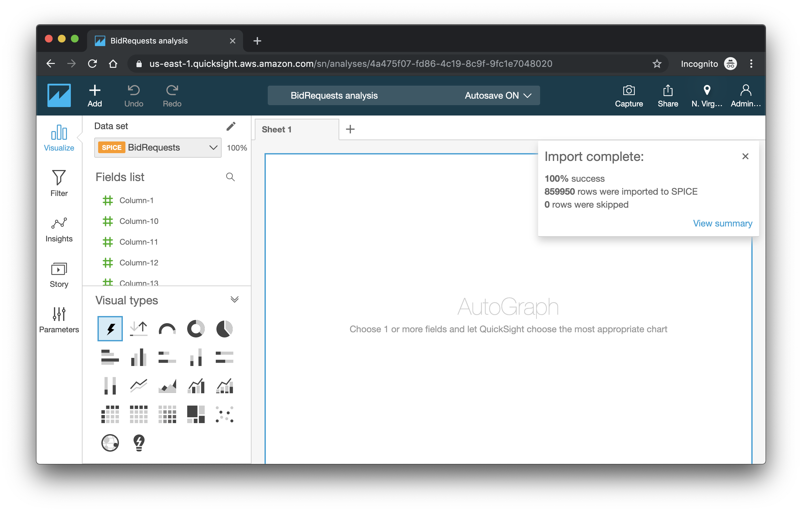

# aws-experiments-data-ingestion-and-analytics

This experiment simulates data ingestion of bid requests to a serverless data lake and data analytics pipeline deployed on AWS.

Services in use:

- [AWS Fargate](https://aws.amazon.com/fargate/) for simulating bid requests,
- [Amazon Kinesis Data Firehose](https://aws.amazon.com/kinesis/data-firehose/) for data ingestion,
- [Amazon Kinesis Data Analytics](https://aws.amazon.com/kinesis/data-analytics/) for data enhancement,
- [Amazon S3](https://aws.amazon.com/s3/) for data storage,
- [AWS Lambda](https://aws.amazon.com/lambda/) for publishing near real time measures,
- [Amazon QuickSight](https://aws.amazon.com/quicksight/) for data visualization,
- [Amazon CloudWatch](https://aws.amazon.com/cloudwatch/) for near realtime data visualization.

[Data used](https://s3-eu-west-1.amazonaws.com/kaggle-display-advertising-challenge-dataset/dac.tar.gz) for this experiment are coming from the [Kaggle Display Advertising Challenge Dataset](https://labs.criteo.com/2014/02/download-kaggle-display-advertising-challenge-dataset/) published in 2014 by [Criteo](https://www.kaggle.com/c/criteo-display-ad-challenge/data). If you are curious or if you want to push the Criteo Dataset further, you can refer to their 2015 [announcement](https://labs.criteo.com/2015/03/criteo-releases-its-new-dataset/) and the related [download](https://labs.criteo.com/2013/12/download-terabyte-click-logs-2/).

Every time it is possible, this experiment leverages [AWS CDK](https://docs.aws.amazon.com/cdk/latest/guide/home.html) to deploy the required infrastructure.

## Table of content

- [Architecture overview](#architecture-overview)
- [Pre requisites](#pre-requisites)
- [Deployment of the experiment](#deployment-of-the-experiment)
  - [Download necessary Data](#download-necessary-data)
  - [Build the CDK application](#build-the-cdk-application)
  - [Deploy the stack and upload the data](#deploy-the-stack-and-upload-the-data)
  - [Deploy Amazon QuickSight](#deploy-amazon-quicksight)
    - [Preparing the Manifest file](#preparing-the-manifest-file)
    - [Signing\-up](#signing-up)
    - [Creating a dataset](#creating-a-dataset)
- [Exploring the demo](#exploring-the-demo)
  - [Launch the producer](#launch-the-producer)
  - [What has been deployed](#what-has-been-deployed)
    - [Kinesis Data analytics](#kinesis-data-analytics)
  - [Results](#results)
- [Cost](#cost)
- [Solutions alternatives](#solutions-alternatives)
- [Develop](#develop)
  - [Start watching for changes](#start-watching-for-changes)
  - [Useful commands](#useful-commands)
- [Clean up](#clean-up)
- [Inspiring source of information](#inspiring-source-of-information)

## Architecture overview

1. Producer: AWS Fargate push data from the CSV file to Amazon Kinesis Data Firehose
2. Ingestion: Amazon Kinesis Data Firehose ingests the data
3. Enhancement: Amazon Kinesis Data Analytics:
    - enhances the data with catalog stored in Amazon s3
    - triggers a AWS Lambda function to store real time measures in Amazon CloudWatch
4. Visualization:
    - Amazon CloudWatch allows visualization of custom near real-time metrics
    - Amazon Quick Sights allows reporting on enhanced data stored in Amazon S3

## Pre requisites

For this experiment you will need the following:

- The [AWS CLI](https://docs.aws.amazon.com/cli/latest/userguide/cli-chap-install.html)
- An AWS account. If you don’t have an AWS account, you can create a free account [here](https://portal.aws.amazon.com/billing/signup/iam).
- Node.js (>= 8.10). To install Node.js visit the [node.js](https://nodejs.org/en/) website. You can also a node version manager: [nvm](https://github.com/nvm-sh/nvm)
- The [AWS CDK](https://docs.aws.amazon.com/cdk/latest/guide/getting_started.html) toolkit: `$> npm install -g aws-cdk`

If this is the first time you deploy a CDK application in an AWS environment, you need to bootstrap it: `cdk bootstrap`. Please take a look at the bootstrap section of the [CDK workshop](https://cdkworkshop.com/20-typescript/20-create-project/500-deploy.html).

## Deployment of the experiment

The deployment is a 4 steps process:

1. Download necessary data
2. Build the CDK application
3. Deploy the stack and upload the data
4. Deploy Amazon QuickSight

### Download necessary Data

Download the [data](https://s3-eu-west-1.amazonaws.com/kaggle-display-advertising-challenge-dataset/dac.tar.gz), extract it to the `data` directory.

*Important*: we don't want to upload the whole dataset, therefore we are taking a small amount of it with the following command in the `data` directory:

```bash
$> head -5000000 train.txt > bidrequests.txt
```

*Data fields*:

- C0 (Integer) - Indicates if an ad was clicked (1) or not (0).
- C1-C13 - 13 columns of integer features mostly representing count features.
- C14-C39 - 26 columns of categorical features. The values of these features have been hashed onto 32 bits for anonymization purposes.

### Build the CDK application

At the root of the repository:

```bash
$> npm install
```

This will install all the AWS CDK project dependencies.

```bash
$> npm run build
```

This command will build the CDK application: compile Typescript code into Javascript.

### Deploy the stack and upload the data

To deploy the CDK application:

```bash
$> cdk deploy
```

This command will generate a cloud formation stack that will be pushed to your configured account. This will create 60 resources (Roles, Streams, Lambda functions, Container Registry, etc.)

Note: if you change parameters or code of the CloudWatch's dashboard, you must delete it in the console before pushing the update with `cdk`.

### Deploy Amazon QuickSight

In order to deploy the Amazon QuickSight dashboard, you must do the following:

1. Preparing a `manifest.json` file
2. Signing-up
3. Creating a dataset

A pre requisite to the deployment of Amazon QuickSight using a S3 bucket is that the data actually exist in the bucket. So, please follow this part once you have launch the data producer.

#### Preparing the Manifest file

On your local computer, edit the `manifest.json` file in the `visualization` folder. Use the output `DataExperimentStack.VisualizationLayerQuickSightManifestFile` of the deployed stack or replace `XXXXXXXXXXXXX` with the URi of you bucket in the provided `manifest.json` file.

For more information on the Manifest file, please have a look to [Supported Formats for Amazon S3 Manifest Files](https://docs.aws.amazon.com/quicksight/latest/user/supported-manifest-file-format.html).

#### Signing-up

If you have already [signed up](https://docs.aws.amazon.com/quicksight/latest/user/signing-up.html.) for Amazon QuickSight or you haven't selected this experiment bucket during the sign-up, please allow QuickSight to [read the bucket](https://docs.aws.amazon.com/quicksight/latest/user/managing-permissions.html) of this experiment. You can find the bucket name in the output of the `cdk deploy` command line or from the `Cloud Formation` console.

#### Creating a dataset

In this section you are going to create a [new QuickSight dataset using Amazon S3 files](https://docs.aws.amazon.com/quicksight/latest/user/create-a-data-set-s3.html).

From the QuickSight home page:

- Click on "Manage Data"
- Click on "New Data Set"
- Select "S3"
- Enter a "Data Source Name" and select your local `manifest.json` file.



- Click "Connect"

You should see the following screen:



Your good to go for the deployment. For further QuickSight exploration. See [Exploring the demo](#exploring-the-demo).

Once the import is finished, you will get the following screen:



Note: Amazon QuickSight has certain [Data Source Limits](https://docs.aws.amazon.com/quicksight/latest/user/data-source-limits.html). In particular, the total size of the files specified in the manifest file can't exceed 25 GB, or you can't exceed 1,000 files. Therefore, as we are pointing to row data, we should only indicate a particular day in the `manifest.json` file. For instance:

```json
{
  "fileLocations": [
    {
      "URIPrefixes": [
        "https://s3.us-east-1.amazonaws.com/dataexperimentstack-bidrequestexperimentstoragecc-XXXXXXXXXXXXX/raw-data/2019/09/01/"
      ]
    }
  ],
  "globalUploadSettings": {
    "format": "TSV",
    "delimiter": "\t",
    "containsHeader": "false"
  }
}
```

## Exploring the demo

Before starting the exploration of the demo, let's launch the producer. This will populate the demonstration with data.

### Launch the producer

If you encounter the following error `"Unable to assume the service linked role. Please verify that the ECS service linked role exists."` while launching the producer, please follow instructions [here](https://docs.aws.amazon.com/AmazonECS/latest/developerguide/using-service-linked-roles.html#create-service-linked-role) and create the linked service role:

```bash
$> aws iam create-service-linked-role --aws-service-name ecs.amazonaws.com
```

### What has been deployed

#### Kinesis Data analytics

[In-application Streams and Pumps](https://docs.aws.amazon.com/kinesisanalytics/latest/dev/streams-pumps.html)
[Extend data with a referential](https://docs.aws.amazon.com/kinesisanalytics/latest/dev/app-add-reference-data.html)

### Results

## Cost

## Solutions alternatives

## Develop

Since this CDK project is typescript based, sources need to be compiled to JavaScript every time you make a modification to source files. This project is configured with a nice little npm script called `watch` that automatically compile `.js` file every time you make a change

### Start watching for changes

In the home directory, open a new terminal and enter:

```bash
$> npm run watch
```

### Useful commands

- `npm run build`   compile typescript to js
- `npm run watch`   watch for changes as you edit the application and compile
- `cdk deploy`      deploy this stack to your default AWS account/region
- `cdk diff`        compare deployed stack with current state
- `cdk synth`       emits the synthesized CloudFormation template
- `cdk destroy`     destroy the CDK application in your default AWS account/region

Note: a `cdk diff` command might take up to the minute. The main reason here is that the CDK command perform a hash of a very big file (`train.txt`) that we are uploading as an asset of the application.

## Clean up

Destroy the CDK application:

```bash
$> cdk destroy
```

## Inspiring source of information

1. Producer:
    - [Data](https://s3-eu-west-1.amazonaws.com/kaggle-display-advertising-challenge-dataset/dac.tar.gz)
    - [Pushing csv to Kinesis firehose](https://github.com/cetic/push2firehose)
    - [Uploading data to s3](https://docs.aws.amazon.com/cdk/latest/guide/assets.html) leveraging the Amazon S3 assets type
    - [Creating an AWS Fargate Service Using the AWS CDK](https://docs.aws.amazon.com/cdk/latest/guide/ecs_example.html)
    - [aws-ecs-patterns](https://docs.aws.amazon.com/cdk/api/latest/docs/aws-ecs-patterns-readme.html) CDK module
    - [fargate-service-with-logging](https://github.com/aws-samples/aws-cdk-examples/blob/master/typescript/ecs/fargate-service-with-logging/index.ts)
    - [Building docker image with CDK](https://docs.aws.amazon.com/cdk/api/latest/docs/aws-ecr-assets-readme.html)
    - [ecs-demo Dockerfile](https://github.com/aws-samples/ecs-demo-php-simple-app/blob/master/Dockerfile)
    - [Deploy Go Applications to ECS using AWS CDK](https://medium.com/tysonworks/deploy-go-applications-to-ecs-using-aws-cdk-1a97d85bb4cb) and its [repository](https://github.com/TysonWorks/cdk-examples/tree/master/typescript/ecs-go-api)
2. Ingestion:
    - [Creating a kinesis firehose with CDK](https://docs.aws.amazon.com/cdk/api/latest/docs/@aws-cdk_aws-kinesisfirehose.CfnDeliveryStream.html) + supportive [CloudFormation documentation](https://github.com/awsdocs/aws-cloudformation-user-guide/blob/master/doc_source/aws-resource-kinesisfirehose-deliverystream.md)
3. Enhancement:
    - [Creating a kinesis data analytics application with CDK](https://docs.aws.amazon.com/cdk/api/latest/docs/aws-kinesisanalytics-readme.html) + supportive [CloudFormation documentation](https://docs.aws.amazon.com/AWSCloudFormation/latest/UserGuide/aws-resource-kinesisanalyticsv2-application.html)
    - Uploading reference file to S3
    - Send results to S3
    - Enhance data in one way or the other 😅
    - Connect a lambda function to publish metrics to lambda start [here](https://github.com/aws-samples/realtime-web-analytics-workshop/blob/master/module-2/README.md) and [here](https://github.com/aws-samples/realtime-web-analytics-workshop/blob/master/module-3/README.md)
4. Visualization:
    - [Create an Analysis using Your own Amazon S3 Data](https://docs.aws.amazon.com/quicksight/latest/user/getting-started-create-analysis-s3.html)
    - [Create a graph in Amazon CloudWatch](https://github.com/aws-samples/realtime-web-analytics-workshop/blob/master/module-3/README.md) the idea is to provide number of clicked and not clicked ads per minute
